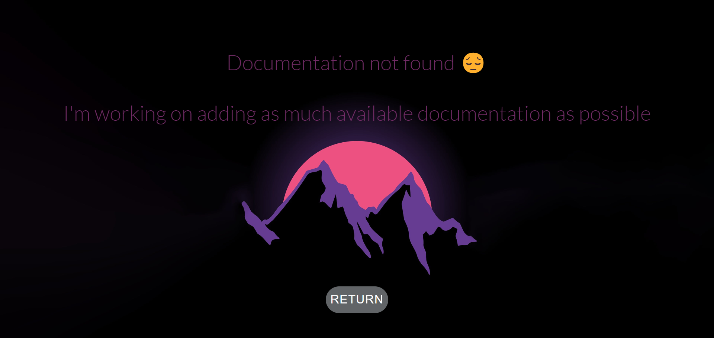

  
  <h1>DevOps-Tools Website</h1>
  
  

    Documentation Website for a beginner DevOps engineer
  

  

    &nbsp;
    &nbsp;
    &nbsp;
  

  <h4>
    <a href="https://github.com/MatveyGuralkiy">View Demo</a>
   · 
    <a href="https://github.com/MatveyGuralkiy">Documentation</a>
   · 
    <a href="https://github.com/MatveyGuralkiy">Report Bug</a>
   · 
    <a href="https://github.com/MatveyGuralskiy/DevOps-Tools-Website/issues">Request Feature</a>
  </h4>

 
 
<h2>🔍 About the Project</h2>

  Discover extensive documentation for various DevOps programs. Effortlessly navigate through our library using our powerful search feature. Simplify deployment processes with step-by-step guides and best practices. Optimize performance and scalability with tailored strategies. Stay updated on industry trends and integrate seamlessly with your existing toolchain. Join our vibrant community and revolutionize your DevOps initiatives today.

<h2>📂 Repository</h2>

  |-- /Background

  |-- /CSS

  |-- /Icons

  |-- /Javascript
       
  |-- /Pages

  |-- /Screens
       
  |-- LICENSE
       
  |-- README.md
  
  |-- index.html

<h2>🎬 View Demo</h2>

Comming soon...

 
 
 
 
 

<h2>🌄 Screens of the Project</h2>
<h3>Homepage of the Website: </h3>
 
 

  

<h3>Ansible Documentation Page: </h3>
 
 

  

<h3>Not Found, Error Page: </h3>
 
 

  

<h2>© License</h2>

Distributed under the MIT license. See LICENSE.txt for more information.

<h2>📢 Additional Information</h2>

  I hope you liked my project, don’t forget to rate it and if you notice a code malfunction or any other errors.
  
  Don’t hesitate to correct them and be able to improve your project for others

